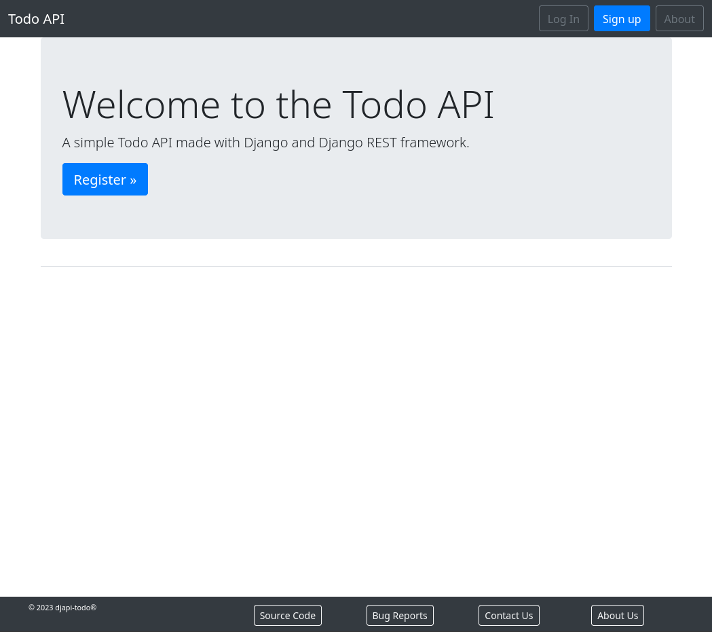
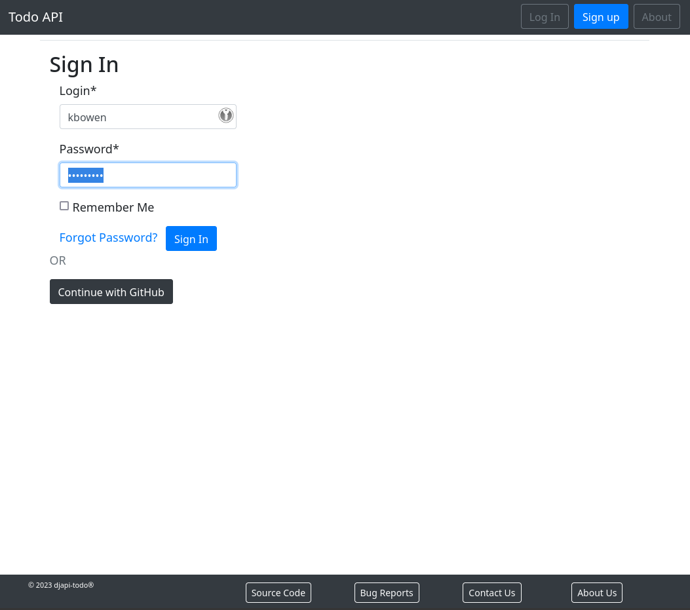
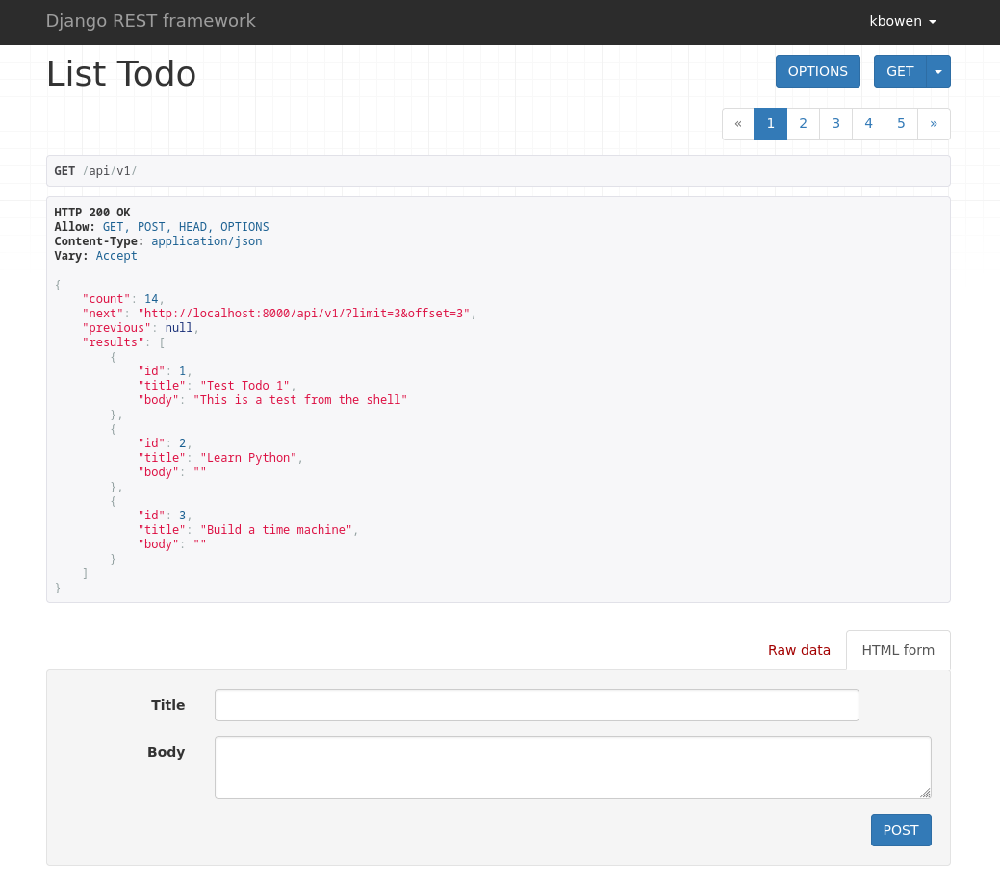
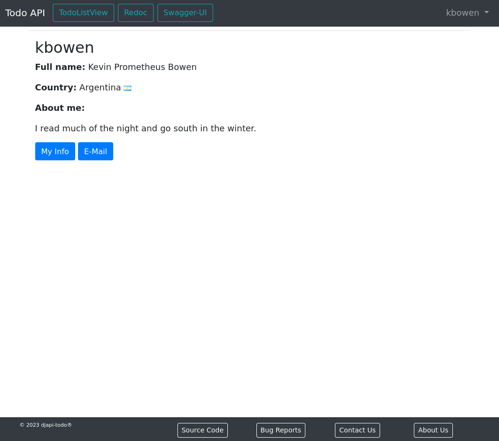
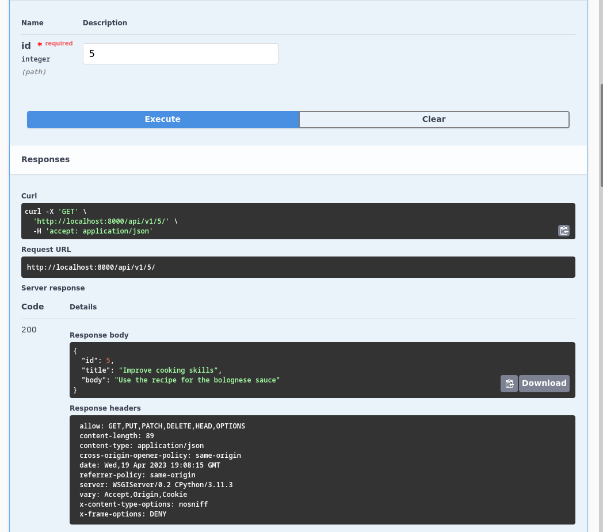

## djapi-todo

 

  
  
  
  

 - A basic to-do/task application & API built with Django 5.1.x & Django REST Framework (DRF) 3.13.x

[Mirror repository](https://gitlab.com/kevinbowen/djapi-todo.git)

##### Table of Contents
 - [Features](#features)
 - [Installation](#installation)
 - [Testing](#testing)
 - [API URLs](#api-urls)
 - [Application Demo](#application-demo)
 - [Screenshots](#screenshots)
 - [Reporting Bugs](#reporting-bugs)

---

### Features
 - Application
     - Browseable Web API
     - SwaggerUI & ReDoc API documentation
     - User registration with email verification & social(GitHub) login using [django-allauth](https://pypi.org/project/django-allauth/)
     - [Bootstrap4](https://pypi.org/project/django-bootstrap4/) & [crispy-forms](https://pypi.org/project/django-crispy-forms/) decorations
     - Customizable user profile pages with bio, profile pic, & [country flags](https://pypi.python.org/pypi/django-countries)
     - For additional links to package resources used in this repository, see the [Package Index](docs/package_index.md)
 - Dev/testing
     - Basic module testing templates
     - [Coverage](https://pypi.org/project/coverage/) reports in `htmlcov` directory
     - [Debug-toolbar](https://pypi.org/project/django-debug-toolbar/) available. See notes in `config/settings.py` for enabling.
     - Examples of using [Factories](https://pypi.org/project/factory-boy/) & [pytest](https://pypi.org/project/pytest/) fixtures in account app testing
     - [shell_plus](https://django-extensions.readthedocs.io/en/latest/shell_plus.html) with [IPython](https://pypi.org/project/ipython/) via [django-extensions](https://pypi.python.org/pypi/django-extensions/) package
     - [Nox](https://pypi.org/project/nox/) testing sessions for latest Python 3.10, 3.11, 3.12, 3.13
         - [black](https://pypi.org/project/black/) (`nox -s black`)
         - [Sphinx](https://pypi.org/project/Sphinx/) documentaion generation (`nox -s lint`)
         - linting (`nox -s lint`)
             - [ruff](https://pypi.org/project/ruff/)
             - [djlint](https://pypi.org/project/djlint/)
         - [safety](https://pypi.org/project/safety/)(python package vulnerability testing) (`nox -s safety`)
         - [pytest](https://docs.pytest.org/en/latest/) sessions with
           [pytest-cov](https://pypi.org/project/pytest-cov/)
           [pytest-django](https://pypi.org/project/pytest-django/) (`coverage run -m pytest`)
  - `run` command menu

    (adapted from Nick Janetakis' helpful [docker-django-example](https://github.com/nickjj/docker-django-example))

    You can run `./run` to get a list of commands and each command has documentation in the run file itself. This comes in handy to run various Docker commands because sometimes these commands can be a bit long to type.

    *If you get tired of typing `./run` you can always create a shell alias with `alias run=./run` in your `~/.bash_aliases` or equivalent file. Then you'll be able to run `run` instead of `./run`.*

---

### Installation
 - `git clone https://github.com/kevinbowen777/djapi-todo.git`
 - `cd djapi-todo`
 - Local installation
     - `poetry install`
     - `python manage.py migrate`
     - `python manage.py createsuperuser`
     - `python manage.py runserver`
 - Docker installation
     - `docker compose up --build`
     - `docker compose exec web python manage.py migrate`
     - `docker compose exec web python manage.py createsuperuser`
     Additional commands:
       - `docker compose exec web python manage.py shell_plus`
         (loads Django shell autoloading project models & classes)
       - `docker run -it django-start-web bash`
         (CLI access to container)
 - Browse to http://127.0.0.1:8000 or http://127.0.0.1:8000/resources/
 - Pre-commit:
     - To add the hook, run the following command in the poetry shell:
         - `pre-commit install`

---

### Testing
 - `docker-compose exec web python manage.py test`
 - `coverage run -m pytest`
 - Nox (includes sessions for black, lint, typing, safety, tests)
     - testing supported for Python 3.10, 3.11, 3.12, 3.13
     - e.g. `nox`, `nox -rs lint-3.13`, `nox -s tests`
       - `nox`
       - `nox -s black-3.12`
       - `nox -s docs-3.13`
       - `nox -rs lint-3.10` (Use the 'r' flag to reuse existing session)
       - `nox -s pyright-3.13`
       - `nox -s safety` (will run tests against all Python versions)
       - `nox -s tests`

---

### API URLs
 - Log In endpoint:
    http://127.0.0.1:8000/api/v1/dj-rest-auth/login/
 - Log Out endpoint:
    http://127.0.0.1:8000/api/v1/dj-rest-auth/logout/
 - Password reset:
    http://127.0.0.1:8000/api/v1/dj-rest-auth/password/reset
 - Password reset confirmation:
    http://127.0.0.1:8000/api/v1/dj-rest-auth/password/reset/confirm
 - User registration endpoint:
    http://127.0.0.1:8000/api/v1/dj-rest-auth/registration/
 - User list:
    http://127.0.0.1:8000/api/v1/users/
 - User detail:
    http://127.0.0.1:8000/api/v1/users/1/
 - API schema download:
    http://127.0.0.1:8000/api/schema/
 - Redoc API browser:
    http://127.0.0.1:8000/api/schema/redoc/
 - Swagger-UI:
    http://127.0.0.1:8000/api/schema/swagger-ui/

---

### Application Demo
A live application demonstration:

TBD

---

### Screenshots

### Home

### Login Page

### Todo API list

### Profile Page

### Swagger UI Response

---
### Reporting Bugs

   Visit the [Issues page](https://github.com/kevinbowen777/djapi-todo/issues)
      to view currently open bug reports or open a new issue.
